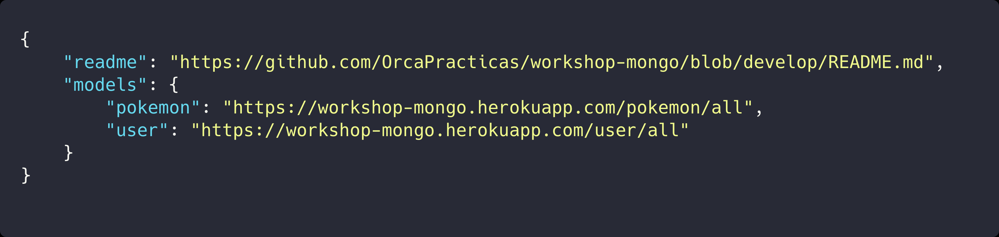
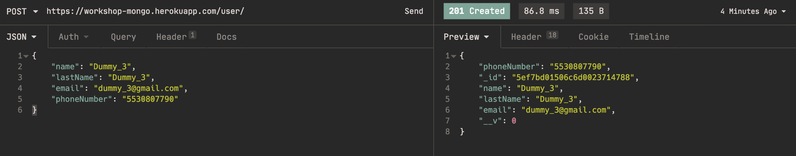
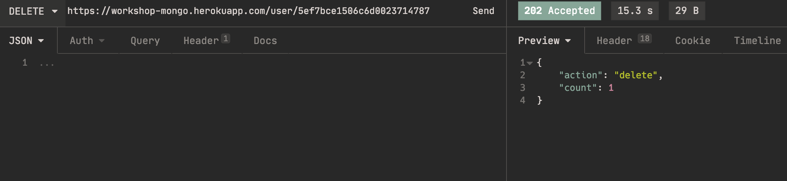
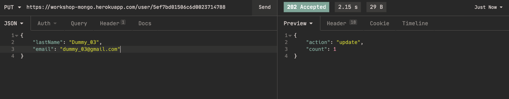
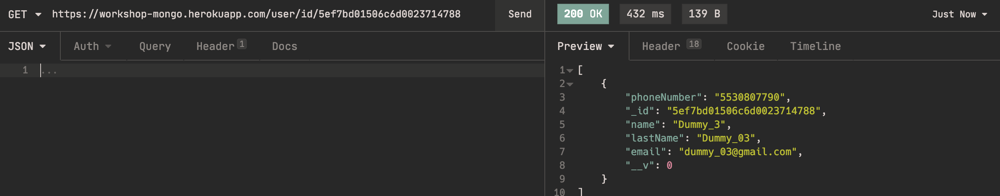
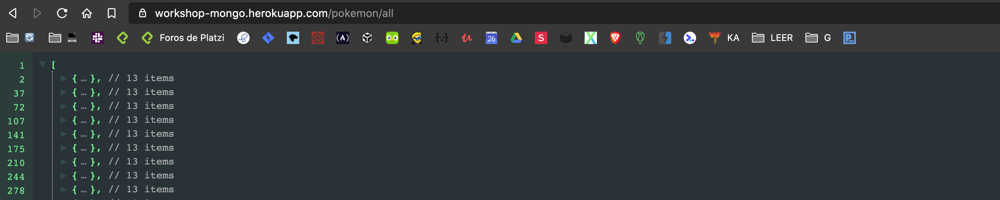
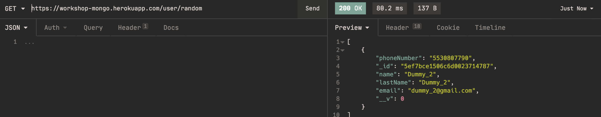

# workshop-mongo

 [](https://badge.fury.io/gh/OrcaPracticas%2Fworkshop-mongo) [](https://workshop-mongo.herokuapp.com/) [](https://www.mongodb.com/)


# 💻 WorkShop Mongo

Desarrollo de **API** utiliazando **Expressjs**, **MongoDBAtlas**, **Heroku** y **Vanilla JS**, el presente proyecto cuenta con un listado de `tag's` los cuales permiten identificar todos los puntos claves durante el desarrollo.

## 🧰 Pre-requisitos

Para poder ejecutar correctamente el presente proyecto es necesario contar con las siguientes instalaciones.

- **[NodeJS](https://nodejs.org/en/download/) :** es un entorno en tiempo de ejecución multiplataforma, de código abierto, para la capa del servidor basado en el lenguaje de programación _ECMAScript_.

- **[Yarn](https://classic.yarnpkg.com/en/docs/install#debian-stable) :** Es un tipo de instalador de paquetes JavaScript y gestor de dependencias lanzado por _Facebook_.

- **[MongoDBAtlas](https://account.mongodb.com/account/login) :** Este es un servicio en la nube que nos permite utilizar MongoDB puedes crear una cuenta si quieres probar su poder, en todo caso la practica ya cuenta ya con una conexión. 

> 🔖 Nota: Se recomiendo descargar las versiones LTS (Long-Term Support).

## ⚙️ Instalación

### 🚶🏻‍♂️Paso 1

Iniciaremos clonando el presente repositorio para este lo podemos hacer de dos maneras.

- Cunado no se esta utilizando una llave `SSH`

```bash
    git clone https://github.com/OrcaPracticas/workshop-mongo.git
```

- Cunado se esta utilizando una llave `SSH`

```bash
    git clone git@github.com:OrcaPracticas/workshop-mongo.git
```

> **🔖 Nota :** En caso de que no sepas como configurar una llave SSH puedes ver el siguiente articulo **[Connecting to GitHub with SSH](https://help.github.com/en/github/authenticating-to-github/connecting-to-github-with-ssh)**

### 🚶🏻‍♂Paso 2

Al terminar de clonar el repositorio nos posicionaremos en el directorio que se genero.

```bash
    cd ./workshop-mongo
```
### 🚶🏻‍♂Paso 3

Al estar dentro del directorio es necesario crear las siguientes variables de entorno.

- Cunado se esta utilizando MacOs o Linux basta con los siguientes comandos.


- Cuando se esta utilizando Windows puedes consultar el siguiente link
[Como crear variables de entorno en windows](https://www.genbeta.com/desarrollo/variables-entorno-que-sirven-como-podemos-editarlas-windows-linux)

### 🚶🏻‍♂️Paso 4

Al estar en el directorio indicado, procederemos a realizar la instalación de dependencias esta acción la podemos realizar de 2 maneras.

- Usando yarn

```bash
    yarn install
```

- Usando npm

```bash
    npm i
```

al terminar la instalación de las dependencias procederemos a correr la aplicación.

> **🔖 Nota :** Realmente [yarn](https://yarnpkg.com/getting-started) puede ser opcional, pero seria bueno que lo revisaras en el caso de que no lo conozcas.

### 🚶🏻‍♂️Paso 5

La aplicación se puede correr de la siguiente manera

#### 🛠 Desarrollo

Este es utilizado cuando estamos en el proceso de desarrollo del aplicativo por lo cual para esta opción s muy encontrar cosas como `nodemon` el cual nos permite refrescar el código conforme generemos cambios, el comando que se utilizaremos es.

- Usando yarn

```shell
    yarn dev
```

- Usando npm

```shell
    npm run dev
```

#### 🖥 Producción

Este es utilizado cuando el desarrollo esta listo para salir a la luz prácticamente se realizara la publicación.

- Usando yarn

```shell
    yarn start
```

- Usando npm

```shell
    npm start
```

> **🔖 Nota :** Podrás ver el api en la ruta **<http://localhost:3000>** la cual te listara las colecciones disponibles sobre las cuales puedes iterar.




### 🚶🏻‍♂️Paso 6

Al contar con el servidor corriendo podremos iniciar con la interacción del `API` las opciones que nos presenta son.

#### 📕 CREATE

Permite crear un nuevo registro, para poder utilizar esta opción es necesario seguir los siguientes pasos.

- Para enviar data se utiliza el metodo **POST**
- La url tiene que ser http://localhost:3000/[nombre del modelo]
 



#### 📗 DELETE

Borra un registro existente, para poder utilizar esta opción es necesario seguir los siguientes pasos.

- Para enviar data se utiliza el metodo **DELTE**
- La url tiene que ser http://localhost:3000/[nombre del modelo]/[_id]



#### 📘 UPDATE

Actualiza un registro, para poder utilizar esta opción es necesario seguir los siguientes pasos.

- Para enviar data se utiliza el metodo **PUT**
- La url tiene que ser http://localhost:3000/[nombre del modelo]/[_id]



#### 📙 READ

Permite la busqueda de registro por un campo expecifico, para poder utilizar esta opción es necesario seguir los siguientes pasos.

- Para enviar data se utiliza el metodo **GET**
- La url tiene que ser http://localhost:3000/[nombre del modelo]/[nombre_del_campo]/[busqueda]




Se cuenta con algunos metodos especiales los cuales son.

#### 🔎ALL
Te muestra todo los registro dentro de la colección, para poder utilizar esta opción es necesario seguir los siguientes pasos.

- Para enviar data se utiliza el metodo **GET**
- La url tiene que ser http://localhost:3000/[nombre del modelo]/all



#### 🎰 RANDOM
Te muestra un registro de manera aleatoria, para poder utilizar esta opción es necesario seguir los siguientes pasos.

- Para enviar data se utiliza el metodo **GET**
- La url tiene que ser http://localhost:3000/[nombre del modelo]/random



## 📦 Deployment

Es importante mencionar que el proyecto cuenta con `tag's` que facilita el movimiento entre las etapas del desarrollo realizado.

- **[⚙️ Configuraciones iniciales](https://github.com/OrcaPracticas/workshop-mongo/releases/tag/Configuracion)**
- **[📦 Instalación de dependencias](https://github.com/OrcaPracticas/workshop-mongo/releases/tag/Instalaci%C3%B3n)**
- **[🛠 Armado de Tools y Models](https://github.com/OrcaPracticas/workshop-mongo/releases/tag/ToolsyModels)**
- **[📡 Conexión con MongoDB Atlas](https://github.com/OrcaPracticas/workshop-mongo/releases/tag/Conexion)**
- **[👨🏻‍💻 Integración de Crud](https://github.com/OrcaPracticas/workshop-mongo/releases/tag/Crud)**
- **[⚙️Configuración Heroku](https://github.com/OrcaPracticas/workshop-mongo/releases/tag/Heroku)**

Cada una de las faces correspondientes al desarrollo, con su **Release** el cual tiene relación con un **Pull-Request** el cual su vez tiene relación con un **Milestone** el cual tienen relación con **Issues** y estos tienen relacionados los **commits**.

## 🛠 Construido con

Para el desarrollo del presente proyecto se utilzan las siguientes dependnecias 

[](https://www.npmjs.com/package/body-parser)
[](https://www.npmjs.com/package/cli-color)
[](https://www.npmjs.com/package/compression)
[](httsp://www.npmjs.com/package/cors)
[](https://www.npmjs.com/package/express)
[](https://www.npmjs.com/package/helmet)
[](https://www.npmjs.com/package/mongoose)

[](https://www.npmjs.com/package/@babel/cli)
[](https://www.npmjs.com/package/@babel/core)
[](https://www.npmjs.com/package/@babel/node)
[](https://www.npmjs.com/package/@babel/plugin-proposal-class-properties)
[](https://www.npmjs.com/package/@babel/plugin-proposal-private-methods)
[](https://www.npmjs.com/package/@babel/preset-env)
[](https://www.npmjs.com/package/@babel/register)
[](https://www.npmjs.com/package/babel-eslint)
[](https://www.npmjs.com/package/babel-plugin-inline-json-import)
[](https://www.npmjs.com/package/babel-plugin-module-resolver)
[](https://www.npmjs.com/package/babel-plugin-transform-define)
[](https://www.npmjs.com/package/eslint)
[](https://www.npmjs.com/package/eslint-config-airbnb)
[](https://www.npmjs.com/package/eslint-config-prettier)
[](https://www.npmjs.com/package/eslint-import-resolver-babel-module)
[](https://www.npmjs.com/package/eslint-plugin-import)
[](https://www.npmjs.com/package/eslint-plugin-jsx-a11y)
[](https://www.npmjs.com/package/eslint-plugin-module-resolver)
[](https://www.npmjs.com/package/eslint-plugin-prettier)
[](https://www.npmjs.com/package/nodemon)
[](https://www.npmjs.com/package/prettier)

## ✒️ Autores

* **[Jorge Mendez Ortega](https://github.com/OrcaPracticas)**

## 📚 Publicaciones

* **[DEV.to](https://github.com/OrcaPracticas)**
* **[Medium](https://medium.com/@jmz12)**
* **[Linkedin](https://dev.to/konami12)**

## 📄 Licencia

Este proyecto está bajo la Licencia MIT mira el archivo [LICENSE](LICENSE) para detalles.

⌨️ con ❤️ por [Konami12](https://github.com/konami12) 😊.